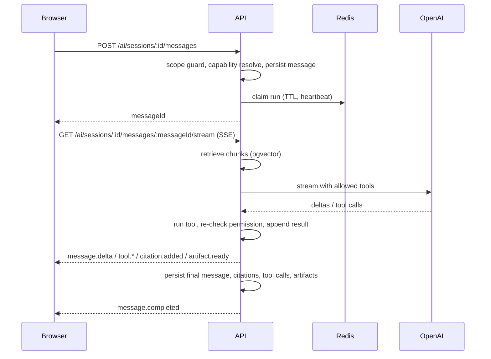
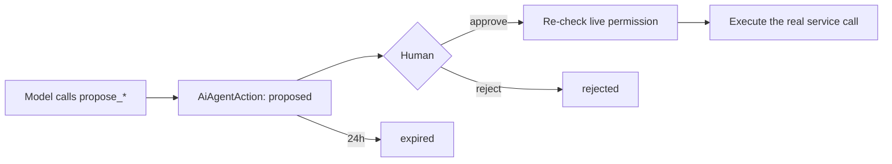

# AI subsystem

Two AI capabilities a grounded conversational copilot and a rubric-scored
pitch-deck analysis plus the retrieval, tool, and safety machinery underneath
them. Everything here is gated by `AI_ENABLED`.

## Design stance

The model is treated as **untrusted input that happens to be useful**, never as
a privileged actor. Three rules follow:

1. **Capabilities are derived from the caller's role.** A missing underlying
   permission removes a tool entirely it is not offered to the model, so it
   cannot appear in prompt context either.
2. **The model can never write.** Anything that would change external state is
   created as a proposal a human must approve, and approving re-checks the
   permission the manual action would require.
3. **Answers are grounded and cited.** Retrieved chunks are scoped to the
   startup and the caller's document permissions, and citations point back at
   the chunk that justified each claim.

That is what keeps a prompt-injected instruction "email everyone that the
round is closing" from ever becoming an outbound action.

## Module map

| Concern | File |
|---|---|
| Provider calls (OpenAI) | `services/ai-provider.service.ts` |
| Vector retrieval | `services/ai-retrieval.service.ts` |
| Capability allowlist | `services/ai-capabilities.service.ts` |
| Tool implementations | `services/ai-tools.service.ts` |
| Conversation orchestration | `services/ai-conversation.service.ts` |
| Session CRUD | `services/ai-chat.service.ts` |
| Stream fan-out and replay | `services/ai-stream-broker.service.ts` |
| Cross-process run ownership | `services/ai-run-registry.ts` |
| Structured artifacts | `services/ai-artifact.service.ts` |
| Propose-only actions | `services/ai-actions.service.ts` |
| Pitch-deck analysis | `services/ai-analysis.service.ts` |
| Rubric and schemas | `config/ai-rubric.ts` |
| Scope guard | `services/ai-scope.ts` |
| Offline evaluation | `services/ai-evaluation.service.ts`, `evals/fixtures.ts` |
| Configuration | `config/ai.ts` |
| Feature gate | `middleware/ai-enabled.ts` |
| Frontend | `pages/dashboard/Ai/`, `hooks/useAiStream.ts`, `lib/ai-api.ts` |

## Conversation flow



Submitting a prompt and reading the response are **separate requests**. The POST
persists the message and claims the run; the SSE GET attaches to it. That split
is what makes reconnect, multi-tab, and cross-replica resume possible.

### Stream events

`stream.ready`, `message.started`, `message.delta`, `tool.started`,
`tool.completed`, `citation.added`, `artifact.ready`, `artifact.failed`,
`message.snapshot`, `message.completed`, `message.failed`, `message.cancelled`,
`stream.closed` each with a monotonic `sequence`.

The broker keeps a local buffer for live delivery without a network hop, plus a
**bounded Redis copy** so a reconnect landing on another replica can replay what
it missed. Redis failures never prevent a terminal state from being persisted:
the database is the record, the stream is the transport.

### Run registry

`ai-run-registry.ts` moves three facts into Redis so they are true across
replicas:

| Fact | Mechanism | Why it must be shared |
|---|---|---|
| Is this run alive? | TTL key refreshed by an 8s heartbeat | Without it, replica B marks a healthy generation on replica A as `AI_ORPHANED` |
| How many runs does this user have? | Self-healing set checked against the TTL keys | Otherwise `AI_CONCURRENT_STREAMS_PER_USER` is enforced per process, silently multiplying the cap by the replica count |
| Cancel | pub/sub | A cancel landing on B must reach A, which owns the `AbortController` |

The TTL is what makes a crashed process's run correctly time out instead of
staying "active" forever.

## Retrieval

`ai-retrieval.service.ts` embeds the query, then runs a pgvector cosine search
(`embedding <=> $vector`) over `document_chunks`, filtered to the startup and to
versions with `processing_status = 'ready'`. Candidates are over-fetched (3×
`AI_RETRIEVAL_RESULT_COUNT`), filtered by `AI_MIN_RETRIEVAL_SCORE`, then packed
into `AI_RETRIEVAL_TOKEN_BUDGET`. A session may pin at most 10 document
versions to narrow the search.

**One subtlety worth knowing before touching this query.** The HNSW index is
global across every tenant's chunks a per-tenant index is not practical at
this scale. A startup with a small corpus relative to the platform can therefore
lose real matches: the graph search's fixed candidate pool fills with other
tenants' vectors before the `startup_id` filter is applied, and nothing
downstream can recover a row that was never returned. The fix is pgvector's
iterative scan:

```sql
SET LOCAL hnsw.iterative_scan = 'relaxed_order'
```

`SET LOCAL` confines it to the transaction so it cannot leak onto a pooled
connection's next query, and `relaxed_order` is safe because the outer
`ORDER BY` re-sorts by the real distance.

Embeddings are written by the `embeddings` worker. A document version is
`ready` without them retrieval simply finds nothing for it until the job
succeeds.

## Tools

`AI_TOOL_REQUIREMENTS` in `ai-capabilities.service.ts` maps each tool to the
permissions it needs. `resolveAiCapabilities(grants)` returns only the tools the
caller's role satisfies.

### Read tools

| Tool | Requires |
|---|---|
| `get_startup_profile` | `startup:read` |
| `get_round_health` | `financial:read` |
| `forecast_round_close` | `financial:read` + `pipeline:read` |
| `get_pipeline_summary`, `get_focus_deals`, `get_daily_briefing` | `pipeline:read` |
| `get_investor_context` | `pipeline:read` (commitment amounts added only with `financial:read`) |
| `search_investors`, `list_investors`, `get_pipeline_by_stage` | `pipeline:read` |
| `get_interaction_history`, `list_tasks` | `pipeline:read` |
| `get_reviewer_engagement` | `documents:read` |
| `list_team_conversations`, `search_team_messages` | `chat:read` |

### Propose-only tools

| Tool | Requires |
|---|---|
| `propose_task`, `propose_interaction_log`, `propose_meeting`, `propose_investor_email` | `pipeline:create` |
| `propose_stage_change`, `propose_task_status` | `pipeline:update` |

These gates mirror the manual endpoint's own requirement rather than a lighter
one. Creating a proposal is not a lesser act than performing the write; it is
the same act with a human in the loop.

`AI_MAX_TOOL_ROUNDS` (default 8) bounds tool-call rounds per message. Each tool
call has its own timeout generous relative to a lookup, short enough that a
wedged tool cannot hold a stream open. Exhausting the budget doesn't discard
what was already gathered: one further round runs with tool use disabled, so
the model must answer from the results already in context instead of the
turn ending in a canned apology.

## Propose-only actions



`ai-actions.service.ts` is the only path the model reaches. It never calls a
send, schedule, or write service directly creating a row **proposes** a write,
it never performs one. Action types: `create_task`, `log_interaction`,
`schedule_meeting`, `send_investor_email`, `update_deal_stage`,
`update_task_status`. Payloads are Zod-validated per type; proposals expire
after 24 hours.

Approval (`POST /ai/actions/:actionId/approve`) re-checks the permission the
manual operation would need a role change between proposal and approval is
respected and email/meeting actions additionally pass through the mailbox
flood limiter.

## Artifacts

`action_proposal.v1` is the only artifact type. Every read tool's result (a
briefing, a task list, an investor's context, a forecast) is answered in the
model's own natural-language text instead of a structured card only a
propose_* tool's result becomes a card, because that one isn't decorative: it's
the Approve/Discard UI a human needs to review a drafted task, email, meeting,
or stage change before anything actually happens. It carries no permission
requirement of its own beyond what already produced it the propose_* tool
that created the proposal already enforced the write permission it needs, and
the approve endpoint re-checks again before executing anything.

## Pitch-deck analysis

`POST /startups/:startupId/ai/analyses` queues an `ai-analysis` job
(concurrency 2) against a document version. It requires `ai_reports:create`
**and** `documents:read`.

Rubric `pitch-deck.v1` (`config/ai-rubric.ts`):

- **Scores** 0–100 for narrative, market validation, financial, and confidence.
  Overall is weighted 40 / 35 / 25.
- **Sections** problem, solution, target customer, market, business model,
  traction, go-to-market, competition, and more.
- **Gap status** `supported`, `partial`, `missing`, `conflicting`.
- **Severity** `low`, `medium`, `high`, `critical`.
- **Personas** investor archetypes with their investment lens and the
  questions each would ask.
- **Evidence** every finding links to the `DocumentChunk` behind it. Findings
  about *missing* information are allowed to have no evidence.

The output is constrained twice: an OpenAI structured-output JSON schema *and* a
Zod schema. **Both must agree.** Every field Zod constrains to an enum or a
bounded array must repeat that constraint in the JSON schema drift between
them was the direct cause of every historical `AI_INVALID_ANALYSIS` failure,
when `section` / `status` / `severity` were unconstrained free text on the
provider side. Note that `minLength`/`maxLength` on strings are *not* part of
OpenAI's supported strict-schema subset, so those bounds are Zod-only, enforced
after the response returns.

Capacity: `AI_ANALYSES_PER_STARTUP_PER_DAY` (default 20) and
`AI_QUEUED_ANALYSES_PER_STARTUP` (default 4). `AI_ANALYSIS_MAX_OUTPUT_TOKENS`
defaults to 8000 because a real deck legitimately needs 12 gaps, 8 strengths,
and 4 personas of text chat's 2000-token budget truncated mid-JSON.

## Scope guard

`ai-scope.ts` is a deliberately conservative filter: a prompt is refused only
when it matches a clearly-unrelated pattern **and** contains no fundraising
vocabulary. Domain language always wins. This is a UX guard against the copilot
being used as a general chatbot, not a security control.

## Capacity and cost controls

| Limit | Default | Scope |
|---|---|---|
| `AI_MESSAGES_PER_MINUTE` | 20 | Per authenticated user |
| `AI_CONCURRENT_STREAMS_PER_USER` | 2 | Per user, across replicas |
| `AI_ANALYSES_PER_STARTUP_PER_DAY` | 20 | Per workspace |
| `AI_QUEUED_ANALYSES_PER_STARTUP` | 4 | Per workspace |
| `AI_REQUEST_TIMEOUT_MS` | 30000 | Per provider request |
| `AI_MAX_RETRIES` | 1 | Per provider request |

## Retention

`AI_CHAT_RETENTION_DAYS` defaults to `0`, meaning automatic deletion is **off**.
A positive value runs a daily 03:15 job that deletes archived sessions past the
window, cascading their messages, citations, tool calls, and artifacts.

Off-by-default is deliberate: deleting user prompts and generated content must
be an explicit deployment policy, never an accidental default.

## Evaluation

```bash
npm run eval:ai --workspace=@raise/api
```

`ai-evaluation.service.ts` runs deterministic checks citation validity,
citation coverage, appropriate uncertainty, and whether an unsafe instruction
was followed against `evals/fixtures.ts`. It calls no model and persists no
user content, so it is safe in CI and on a laptop. Production outputs may be
copied into fixtures only after review and de-identification.

## Operating notes

- `AI_EMBEDDING_DIMENSIONS` must stay `1536` while `document_chunks.embedding`
  is `vector(1536)`. Changing the embedding model to one with different
  dimensions requires a migration and a full re-embed.
- Disabling `AI_ENABLED` stops chat and analysis but **not** embeddings those
  follow `OPENAI_API_KEY`.
- AI analysis runs on the worker; conversational streaming stays an API-process
  flow, because it holds an open connection to the browser.
