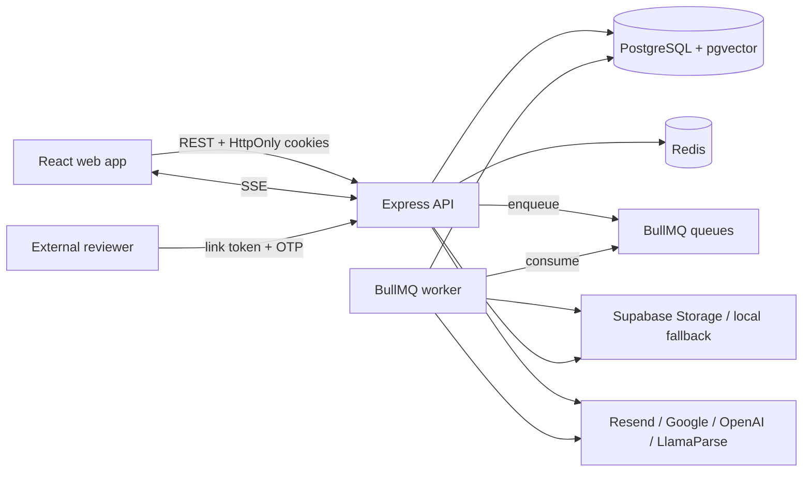
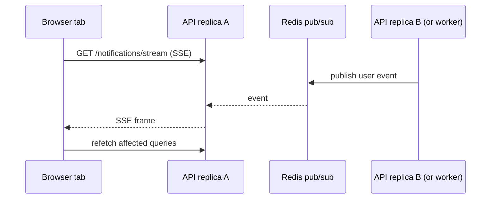
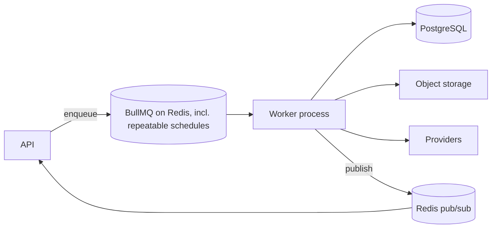
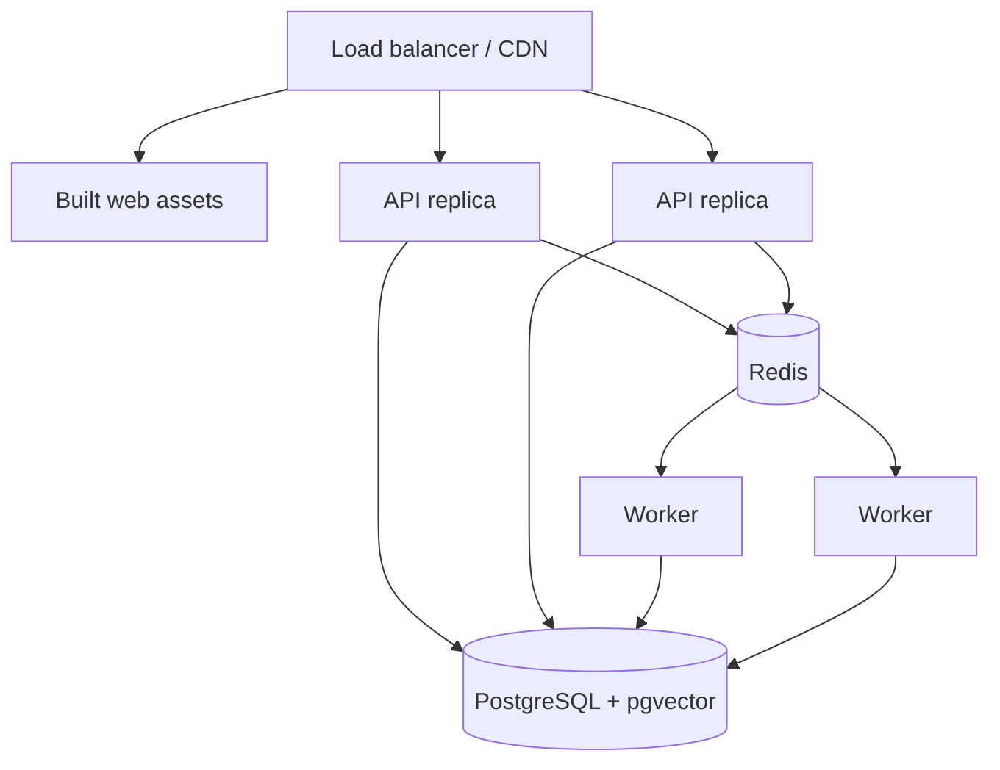

# Architecture

The technical map of the system: what runs, what talks to what, and the rules
that hold the boundaries in place. Update this page when a change alters a
runtime component, a system boundary, or a major flow.

Layer-specific detail lives in [backend.md](backend.md),
[frontend.md](frontend.md), [data-model.md](data-model.md), and the subsystem
pages linked from [docs/README.md](README.md).

## System context

Raise is a multi-tenant fundraising platform. A user can belong to several
startup workspaces; nearly all business data belongs to exactly one startup.

Two distinct audiences share one API but never share an authentication path:

- **Founders and their team** use the React workspace with cookie sessions and
  role-based permissions.
- **External reviewers** open a tokenized data-room link, verify by email OTP,
  and get a separate session that can only reach `/reviewer-portal/*`.



## Runtime components

| Component | Entry point | Responsibility |
|---|---|---|
| Web app | `packages/web/src/main.tsx` | Founder workspace UI and reviewer portal UI |
| API | `packages/api/server.ts` → `app.ts` | REST, auth, SSE, health probes |
| Worker | `packages/api/src/jobs/workers/index.ts` | Durable asynchronous processing, scheduled maintenance tasks |
| PostgreSQL | `packages/api/prisma/schema.prisma` | Transactional data, audit trail, document chunks and vectors |
| Redis | `packages/api/src/db/redis.ts` | BullMQ (including recurring schedules), distributed rate limits, realtime pub/sub, local upload tokens |

**The API and worker are separate processes.** The API enqueues jobs but runs
no BullMQ processors; the worker runs processors but serves no HTTP. Both are
built from the same `@raise/api` package, so they share services, the Prisma
client, and configuration.

**Recurring maintenance runs as BullMQ repeatable jobs, registered once by the
worker.** There is no cron running inside the API the schedule itself lives
in Redis via BullMQ's Job Scheduler API, so exactly one job instance is
produced per due tick regardless of API or worker replica count, and only one
worker instance ever claims it. See [background-jobs.md](background-jobs.md).

## Monorepo boundaries

Two npm workspaces, coordinated by Turborepo:

```text
packages/
  api/    Express API, Prisma access, BullMQ workers (including scheduled
          maintenance), OpenAPI contract
  web/    React + Vite frontend (founder workspace and reviewer portal)
```

There is deliberately **no** `packages/shared` and **no** `packages/workers`.
Background jobs live in `packages/api/src/jobs`.

The two packages share no TypeScript source. The frontend's view of the API is
generated from the contract:

```text
packages/api/openapi.yaml  --[openapi-typescript]-->  packages/web/src/lib/api-types.ts
```

That generation step is the boundary. It is what stops the frontend from
depending on backend internals, and it is why an endpoint change is not
complete until the YAML and the generated types are both updated.

## Request path

A typical startup-scoped request:

```text
route
  → authenticate            verify access-token cookie + live session family
  → validate(params)        Zod-parse and coerce :startupId and friends
  → requireMember           active StartupMember for that exact startup
  → requirePermission       role holds resource:action
  → validate(body|query)    Zod-parse and replace req.body / req.query
  → controller              thin HTTP translation, wrapped in asyncHandler
  → service                 business rules, transactions, tenant-scoped Prisma
  → audit / notify / enqueue
```

Errors raised as `createError(message, status, code)` unwind to the single
error middleware, which emits the shared error envelope. Full detail in
[backend.md](backend.md); the authorization rules in [security.md](security.md).

## Realtime path

One authenticated `EventSource` per signed-in user carries both notifications
and team chat.



Two properties make this robust:

1. **Events are invalidation signals, not the system of record.** The client
   refetches PostgreSQL-backed queries after each event and on reconnect, so a
   dropped or duplicated pub/sub message is self-healing.
2. **Redis is the bus between processes.** An in-process map is correct for one
   API instance and wrong the moment there are two. Tests and
   `REALTIME_BUS=memory` fall back to the in-process implementation.

AI streaming uses a parallel mechanism (`ai-stream-broker.service.ts`) with a
bounded Redis replay buffer, so a reconnect that lands on another replica can
resume mid-generation. See [ai.md](ai.md).

## Asynchronous path



Queues default to three attempts with exponential backoff. **Every job must be
idempotent**: retries, restarts, and multiple consumers are normal operating
conditions, not edge cases. Scheduled maintenance (retention sweeps, daily
reminders, and the like) rides the same queues as a repeatable job the
worker registers each schedule once at boot; see
[background-jobs.md](background-jobs.md).

## Data and storage

- **PostgreSQL** holds everything transactional plus `document_chunks.embedding`
  as `vector(1536)` for pgvector similarity search.
- **Object storage** holds document bytes and rasterized page images. Supabase
  Storage in production; a token-gated local directory
  (`packages/api/.uploads`) when Supabase is unconfigured.
- **Private document bytes are never served by a plain URL.** Access is a
  signed, short-lived path. Avatars are the deliberate exception: they live in
  a separate public bucket because a profile photo is meant to be publicly
  renderable.

See [data-model.md](data-model.md) and [documents.md](documents.md).

## Security boundaries

| Boundary | Enforced by |
|---|---|
| Signed in | `authenticate` access-token cookie **and** a live refresh-token family |
| Member of this startup | `requireMember` `status === "active"`, no other value |
| Allowed to do this | `requirePermission(resource, action)` against the member's role |
| Query cannot escape the tenant | Services select through composite keys such as `startupId_id` |
| Reviewer scope | `requireReviewerSession` separate cookie, separate table, portal routes only |
| Abuse | Redis-backed global and per-scope rate limiters |

Middleware and tenant-scoped persistence are **both** required. Middleware alone
would leave a service one refactor away from an unscoped `findUnique({ id })`;
scoping alone would leak the difference between "forbidden" and "not found".
Details and the full permission matrix: [security.md](security.md).

## Feature gating

Optional integrations are gated at boot, not at call time:

| Feature | Gate |
|---|---|
| AI chat and analysis | `AI_ENABLED=true` plus `OPENAI_API_KEY` |
| Google Calendar / Gmail | All three of `GOOGLE_CLIENT_SECRET`, `GOOGLE_REDIRECT_URI`, `GOOGLE_TOKEN_ENCRYPTION_KEY` |
| Sign in with Google | `GOOGLE_CLIENT_ID` alone |
| Object storage | `SUPABASE_URL` + `SUPABASE_SERVICE_ROLE_KEY`, else local fallback |
| Document parsing beyond `text/plain` | `LLAMA_CLOUD_API_KEY` |
| `/metrics` | `METRICS_ENABLED=true` plus a 32+ character `METRICS_TOKEN` |

`validateEnv()` collects **all** problems and exits with the list, so a
misconfigured deployment fails at boot instead of inside a user request.
Partially configured groups are errors on purpose.

## Observability

- **Pino** structured JSON in production, pretty in development.
- **`/health`** process liveness only. It never checks dependencies, which is
  what keeps it useful for diagnosing a wedged dependency.
- **`/ready`** PostgreSQL and Redis with a 2s timeout; 503 when either is
  down. This is the load-balancer probe.
- **`/metrics`** bounded Prometheus-compatible reviewer metrics, disabled by
  default, bearer-token protected, deliberately outside `/api/v1`.
- Both API and worker handle `SIGTERM`/`SIGINT` and close HTTP, queues, Redis,
  and Prisma before exiting.

See [operations.md](operations.md).

## Deployment shape

Minimum production topology:



Rules that matter:

- API replicas **must** share one PostgreSQL and one Redis. Rate limits,
  BullMQ (including scheduled tasks), realtime fan-out, and AI run ownership
  all depend on it.
- Migrations run as a release step **before** the new API serves traffic.
- The worker scales independently by queue depth.
- `TRUST_PROXY` must match the real proxy hop count. Too low and everyone
  behind the load balancer shares one rate-limit bucket; too high and a client
  can forge `X-Forwarded-For` to dodge limits entirely.

## Known architectural debt

- **No end-to-end browser suite.** Flows that cross web → API → PostgreSQL →
  Redis → SSE are covered only by unit tests on each side.
