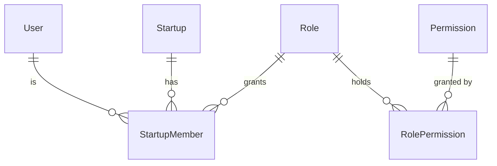
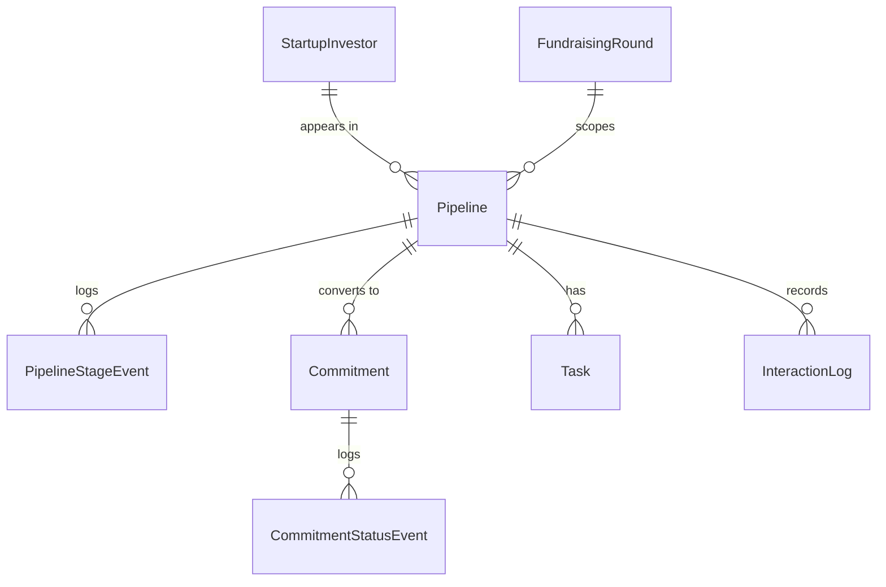
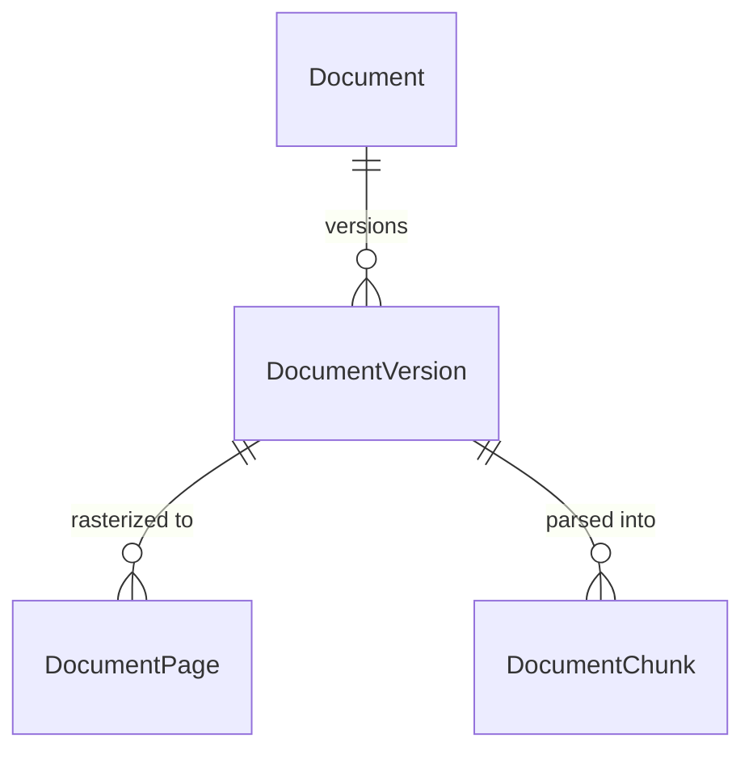

# Data model

The database is PostgreSQL 16 with the `pgvector` extension. Prisma 7 is the
only ORM. The schema of record is
[`packages/api/prisma/schema.prisma`](../packages/api/prisma/schema.prisma) —
this page explains its shape, the invariants that are not obvious from the
field list, and how to change it safely.

## Conventions

| Convention | Detail |
|---|---|
| Primary keys | `String @id @default(uuid())` |
| Naming | camelCase in Prisma, `snake_case` in PostgreSQL via `@map` / `@@map` |
| Tenancy | Startup-owned models carry `startupId` and a `@@unique([startupId, id])` composite |
| Timestamps | `createdAt @default(now())`, `updatedAt @updatedAt` where the row is mutable |
| Money | `Decimal` never a float |
| Soft state | `archivedAt` / `deletedAt` nullable timestamps, not booleans |
| History | Append-only event tables (`*StatusEvent`, `*StageEvent`, `AuditLog`) |

### The `@@unique([startupId, id])` pattern

This composite exists so services can select a row **and** its tenant in one
query:

```ts
prisma.startupInvestor.findUnique({
  where: { startupId_id: { startupId, id: investorId } },
});
```

It also lets child relations reference `[id, startupId]`, which makes the
database itself refuse a row whose parent belongs to another startup. `Pipeline`
is the clearest example: its `round`, `startupInvestor`, and `owner` relations
are all composite, so a deal physically cannot join a round from one workspace
to an investor from another.

## Connection setup

- **Runtime:** Prisma 7 connects through the PostgreSQL driver adapter in
  `src/db/prisma.ts`.
- **CLI:** `prisma.config.ts` supplies `DATABASE_URL` to `prisma migrate`,
  `generate`, `studio`, and friends.

## Domains

| Domain | Principal models |
|---|---|
| Identity and tenancy | `User`, `Startup`, `StartupMember`, `Role`, `Permission`, `RolePermission` |
| Sessions and registration | `RefreshToken`, `PendingRegistration`, `PasswordReset`, `GoogleConnection` |
| CRM | `StartupInvestor`, `Pipeline`, `PipelineStageEvent`, `Task`, `InteractionLog` |
| Fundraising | `FundraisingRound`, `Commitment`, `CommitmentStatusEvent` |
| Documents | `Document`, `DocumentVersion`, `DocumentPage`, `DocumentChunk` |
| Reviewer portal | `ReviewerInvitation`, `ReviewerInvitationDocument`, `ReviewerSession`, `ReviewerComment`, `ReviewerEvent`, `ReviewerVisit`, `ReviewerPageView` |
| Team chat | `Conversation`, `ConversationMember`, `Message`, `MessageReaction`, `MessageAttachment`, `MessageMention` |
| AI | `AiAnalysis`, `AiGapAnalysis`, `InvestorPersona`, `PersonaQuestion`, `AiChatSession`, `AiChatMessage`, `AiChatSessionDocument`, `AiCitation`, `AiToolCall`, `AiRun`, `AiAnalysisEvidence`, `AiArtifact`, `AiAgentAction` |
| Governance | `AuditLog`, `Notification` |

### Identity and tenancy



- `StartupMember` is the join between a user and a workspace, carrying the role
  and the invitation lifecycle (`invitedEmail`, `inviteTokenHash`,
  `inviteExpiresAt`, `joinedAt`).
- `status` defaults to `"pending"`. **Only `"active"` is ever authorized** —
  `requireMember` accepts no other value.
- `userId` is nullable: an invitation can exist before the invitee has an
  account. `@@unique([startupId, invitedEmail])` stops duplicate invitations.
- `Role` is per-startup, so custom roles are possible alongside the seeded
  `owner` / `collaborator` / `viewer` templates. `Permission` is a global
  catalog of `resource` + `action` pairs.
- `Startup` carries structured profile fields (`oneLiner`, `problemStatement`,
  `solutionSummary`, `targetMarket`, `businessModel`, `tractionSummary`,
  `competitiveEdge`) so the AI copilot can reason about fit without re-deriving
  them from free text every time.

### CRM and fundraising



- **`StartupInvestor` is the contact; `Pipeline` is the deal.** One investor can
  appear in several rounds, but only once per round —
  `@@unique([roundId, startupInvestorId])`.
- `description` (a stable profile) is deliberately separate from `notes` (a
  running human scratchpad). Collapsing them would let the copilot quote a
  two-month-old scratch note as if it were a fact.
- `Pipeline.sortOrder` is a `Float` so a card can be dropped between two others
  without renumbering the column.
- `stageChangedAt` powers the "idle deal" reminders; every move also appends a
  `PipelineStageEvent`.
- `Commitment.status` transitions append a `CommitmentStatusEvent`, with
  `fromStatus` null for the first one. Only `hard_circled` and `wired` count as
  bankable see the [glossary](glossary.md).
- Rounds are restrict-deleted from pipeline and stage events: history must not
  vanish because a round row was removed.

### Documents



- `DocumentVersion.processingStatus` is
  `pending_upload → processing → ready | failed`; `renderStatus` tracks page
  rasterization separately.
- **At most one current version per document** is enforced by a partial unique
  index, `document_versions_one_current_per_document` (migration
  `20260823120000_one_current_document_version`), not merely by application
  code.
- `DocumentChunk.embedding` is `Unsupported("vector(1536)")`. Prisma cannot type
  it, so vector search runs through raw SQL in `ai-retrieval.service.ts`. The
  dimension is pinned: `AI_EMBEDDING_DIMENSIONS` must stay `1536` or boot fails.
- `Document.archivedAt` makes archive/restore a reversible state, not a delete.

Full pipeline: [documents.md](documents.md).

### Reviewer portal

- `ReviewerInvitation` holds the link (`tokenHash`), lifecycle
  (`status`, `expiresAt`, `revokedAt`), and every per-link control:
  `allowDownload`, `allowPrint`, `watermarkEnabled`, `screenshotGuard`,
  `notifyOnOpen`, `requireNda`, `allowedEmailDomains`, plus email delivery
  tracking.
- `ReviewerInvitationDocument` is the explicit allowlist of document versions —
  a reviewer can reach nothing else.
- `ReviewerSession` is the verified session; `ReviewerVisit`,
  `ReviewerPageView`, and `ReviewerEvent` are the engagement and security
  telemetry, and are what retention prunes.
- `ReviewerComment` is founder-facing feedback and is **never** deleted by
  retention.

Full model: [reviewer-portal.md](reviewer-portal.md).

### Team chat

- `Conversation.type` is `channel` or DM; `dmKey` is a deterministic key with
  `@@unique([startupId, dmKey])` so a DM pair can only ever have one thread.
- `Message.seq` is a `BigInt @default(autoincrement())` the ordering and
  read-cursor axis. `ConversationMember.lastReadSeq` is compared against it for
  unread counts.
- **`@@unique([conversationId, clientNonce])` is the idempotency constraint.**
  The client sends a nonce with each message and reuses it on retry, so a failed
  send that actually succeeded server-side cannot produce a duplicate.
- `deletedAt` is a tombstone; messages are never hard-deleted, so threads and
  reply counts stay coherent.
- Threading is `parentMessageId` with a denormalized `replyCount`.

### AI

`AiChatSession` → `AiChatMessage` → (`AiCitation`, `AiToolCall`, `AiArtifact`),
with `AiRun` for telemetry and `AiAgentAction` for propose-only actions awaiting
human approval. `AiAnalysis` hangs off a `DocumentVersion` and carries
`AiGapAnalysis`, `InvestorPersona`, `PersonaQuestion`, and
`AiAnalysisEvidence` rows pointing back at the chunks that justified them.

Deleting an `AiChatSession` cascades its messages, citations, tool calls, and
artifacts which is what `AI_CHAT_RETENTION_DAYS` relies on.

Full subsystem: [ai.md](ai.md).

### Governance

- `AuditLog` `startupId`, `userId`, `action`, `entityType`, `entityId`,
  `changes` (JSON), `ipAddress`. Written best-effort so a failed audit insert
  never rolls back the mutation it describes.
- `Notification` persisted first, then published on the realtime bus, so a
  missed SSE frame is recoverable by refetch.

## Migrations

```bash
# Create and apply a development migration after editing schema.prisma
npm run db:migrate:dev --workspace=@raise/api

# Apply committed migrations (deployments, CI, fresh clones)
npm run db:migrate --workspace=@raise/api

# Inspect data
npm run db:studio --workspace=@raise/api
```

Rules:

- **Always commit the migration with the schema change.** A schema edit without
  its migration is an incomplete change.
- **Never use `prisma db push` as a substitute.** It bypasses migration history
  and desynchronizes environments.
- Run `prisma migrate deploy` as a release step **before** the new API serves
  traffic.
- Prefer additive, backward-compatible steps (add nullable column → backfill →
  enforce) so a migration is safe against the previous release still running.
- Add indexes for the access patterns you introduce. Existing hot paths are
  already indexed for example
  `Pipeline @@index([startupId, roundId, stage, sortOrder])` for the board and
  `Message @@index([conversationId, seq])` for pagination.

### Destructive commands

| Command | Effect |
|---|---|
| `npm run db:seed --workspace=@raise/api` | Deletes every application row, then rebuilds demo data |
| `npm run db:reset --workspace=@raise/api` | Drops the database, re-migrates, re-seeds |

Both are development-only. Treat them, and any raw storage deletion, as
production-risk operations.

## Seed data

`prisma/seed.ts` builds a deterministic dataset: the **Northbeam** and **Drift
Labs** workspaces, members across all three role templates (including one
Google-provider account with no password), investors on `*.example.com`
addresses, deals across every stage, rounds and commitments, documents with
versions, chat channels with mentions, and audit history.

Shared password: `Founder1234!`. Development fixtures only never production
credentials.
