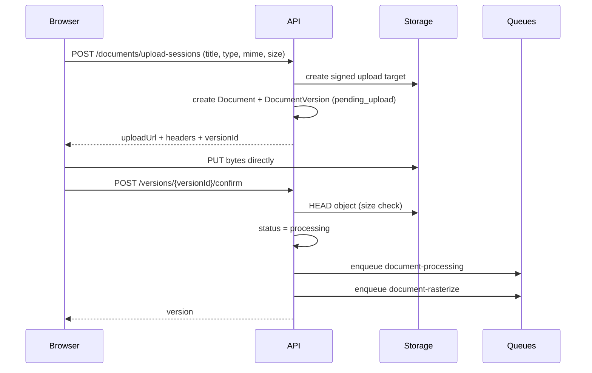

# Documents and storage

How a file gets into the vault, what happens to it afterwards, and how bytes
are read back safely. The user-facing behavior is in
[features.md](features.md#documents).

## Constraints

| Constraint | Value | Source |
|---|---|---|
| Accepted MIME types | `application/pdf`, DOCX, XLSX, PPTX, `text/plain` | `storage.service.ts` `ACCEPTED_MIME_TYPES` |
| Max size | 20 MB (raw upload route caps at 21 MB) | `MAX_UPLOAD_BYTES` |
| Avatar types | `image/webp`, `image/png` | `ACCEPTED_AVATAR_MIME_TYPES` |
| Avatar size | 600 KB (route caps the raw body at 2 MB) | `MAX_AVATAR_UPLOAD_BYTES` |

PNG is accepted for avatars only because Safari's `canvas.toBlob("image/webp")`
silently returns PNG on versions that cannot encode WebP the browser never
errors, it just hands back a different type. JPEG is deliberately not accepted;
nothing on the client produces it.

## Storage backends

| Backend | When | Behavior |
|---|---|---|
| Supabase Storage | `SUPABASE_URL` + `SUPABASE_SERVICE_ROLE_KEY` set | Private `documents` bucket for files and page images; public-read `avatars` bucket |
| Local filesystem | Supabase unset | `packages/api/.uploads`, with upload and download tokens held in Redis |

The local backend is a development convenience, not a production store. Both are
behind `storage.service.ts`, so callers never branch on provider.

**Avatars are public on purpose.** A profile photo is meant to be renderable by
anyone displaying the user, so it is served by direct URL and never through a
signed link. Document bytes are the opposite: never a plain URL, ever.

## Upload: three phases

Uploads are split so that the API never proxies file bytes.



**Phase 1 `POST /startups/:startupId/documents/upload-sessions`**
Validates MIME type and size *before* anything is created, allocates the
document and version ids, asks storage for a signed upload target, and creates
`Document` + `DocumentVersion` (`processingStatus: "pending_upload"`) in one
transaction. Returns the upload URL and headers.

A new version of an existing document uses
`POST /:documentId/versions/upload-sessions` instead. Same shape.

**Phase 2 the browser PUTs bytes** straight to Supabase, or to
`PUT /api/v1/documents/local-upload/:token` on the local backend. That route is
registered in `app.ts` **before** `express.json()` because it carries raw bytes,
and it is authorized by a Redis-held token rather than a session.

**Phase 3 `POST /:documentId/versions/:versionId/confirm`**
Confirms the object exists and is non-empty, flips the version to `processing`,
and enqueues both pipelines. Confirm is **idempotent**: a version that is no
longer `pending_upload` is returned as-is rather than re-enqueued.

### Abandoned uploads

A tab that closes mid-upload leaves a `pending_upload` row nothing else would
ever revisit it would show "Uploading…" forever. A scheduled task
(`stale-document-upload-cleanup`, every 30 minutes) deletes `pending_upload`
versions older than an hour, plus any `Document` left with no versions. See
[background-jobs.md](background-jobs.md#scheduled-tasks).

## Processing: two independent pipelines

Text extraction and page rendering run on **separate queues** on purpose.
Rasterization is CPU-bound and would starve extraction and embeddings, which are
IO-bound and far more latency-sensitive for in-app AI. A deck can be searchable
before it is viewable, and viewable before it is searchable.

### Pipeline A `document-processing` (concurrency 2)

1. Read the object from storage; compute a SHA-256 checksum.
2. Extract markdown (`document-parse.ts`). `text/plain` is handled locally;
   everything else goes to **LlamaParse**. Without `LLAMA_CLOUD_API_KEY` a
   non-text upload fails the version with `PARSE_UNAVAILABLE`.
3. Chunk the markdown (`document-chunking.ts`) into `DocumentChunk` rows with
   token counts, section labels, and character offsets.
4. In one transaction: replace the version's chunks and set
   `processingStatus: "ready"` with the checksum. Replacing rather than
   appending is what makes a retry safe.
5. Enqueue `embeddings` when `OPENAI_API_KEY` is set.
6. Call `promoteNewestUsableDocumentVersion`.

### Pipeline B `document-rasterize` (concurrency 1)

1. PDFs render directly. DOCX and PPTX are converted to PDF first via headless
   LibreOffice (`office-convert.service.ts`, binary from `SOFFICE_BIN`) **only
   the worker image has LibreOffice installed**. XLSX and TXT are marked
   `renderStatus: "unsupported"`, which is an expected terminal state, not a
   failure: they remain valid vault and AI documents but cannot be shared
   through the reviewer portal.
2. Render each page to WebP plus a thumbnail (`pdf-rasterize.ts`, pdfjs +
   `@napi-rs/canvas`), upload them, and write `DocumentPage` rows.
3. Set `renderStatus: "ready"` and `pageCount`.
4. Call `promoteNewestUsableDocumentVersion`.

### Pipeline C `embeddings` (concurrency 5)

Embeds the version's chunks in batches through
`ai-provider.service.embedBatch` and writes `document_chunks.embedding`. A
version reaches `ready` **without** embeddings; semantic retrieval simply finds
nothing for it until this succeeds. Dimensions are pinned at 1536 to match the
`vector(1536)` column.

### Promotion

Because the two pipelines finish independently, neither promotes on its own
completion. Both call `promoteNewestUsableDocumentVersion(documentId)`, which
picks the highest `versionNumber` where `processingStatus = "ready"` **and**
`renderStatus ∈ {ready, unsupported}`, then flips `isCurrent` in a transaction.

The effect: **a healthy current version is never displaced while a newer one is
still processing or has failed.** A partial-unique index
(`document_versions_one_current_per_document`) enforces the "at most one
current" invariant at the database level, not just in code.

`POST /:documentId/versions/:versionId/promote` lets a founder promote a
specific version manually; `…/retry` re-runs both pipelines for a failed
version.

## Status reference

| Field | Values | Meaning |
|---|---|---|
| `processingStatus` | `pending_upload` → `processing` → `ready` \| `failed` | Text extraction and chunking |
| `renderStatus` | `pending` → `rendering` → `ready` \| `unsupported` \| `failed` | Page rasterization |
| `processingError` / `renderError` | string | Surfaced in the UI so a founder can act |

Common error codes: `PARSE_UNAVAILABLE` (no LlamaParse key),
`OBJECT_NOT_FOUND` (confirm found an empty or missing object).

## Reading bytes back

There are three read paths, each with different authority.

| Path | Who | Returns |
|---|---|---|
| `POST /:documentId/file-access` | founder with `documents:read` | Short-lived authorized access to the source file |
| `POST /:documentId/versions/:versionId/pages/:pageNumber/access` | founder with `documents:read` | Short-lived page-image token |
| `GET /reviewer-portal/pages/:versionId/:pageNumber` | verified reviewer | Watermarked page image only |

On the local backend, `GET /api/v1/documents/local-download/:token` serves the
object against a Redis-held token.

**The reviewer path never yields a source-file URL.** The manifest endpoint
deliberately has no route to a signed object URL reviewers get rendered pages,
watermarked per session, authorized by a page token that must match their
session cookie. See [reviewer-portal.md](reviewer-portal.md).

## Lifecycle

| Operation | Endpoint | Permission | Effect |
|---|---|---|---|
| Archive | `POST /:documentId/archive` | `documents:delete` | Sets `archivedAt`; reversible, hidden by default |
| Restore | `POST /:documentId/restore` | `documents:delete` | Clears `archivedAt` |
| Delete | `DELETE /:documentId` | `documents:delete` | Removes the document, its versions, pages, chunks, and stored objects |

Delete is permanent and removes objects from storage. Prefer archive.

## Maintenance

```bash
# Rasterize page images for versions created before the feature existed
npm run db:backfill-pages --workspace=@raise/api
```

`scripts/smoke-upload.ts` exercises the upload path end to end against a running
API.

## Gotchas

- **Node 22.13+ is required.** `pdfjs-dist` 6 uses Node APIs added in 22.13 to
  load its standard font data. On Node 20, rasterized text renders blank with no
  error CI pins the version for this reason.
- **Only the Docker worker converts Office files.** A host worker without
  LibreOffice marks DOCX/PPTX rasterization failed.
- **Do not run two workers against one Redis** unless you intend multiple
  consumers; `docker compose up` already starts one.
- **LlamaCloud keys are region-locked.** An EU-org key against the US base URL
  returns a 401 that reads like a bad key but is not one set
  `LLAMA_CLOUD_BASE_URL`.
