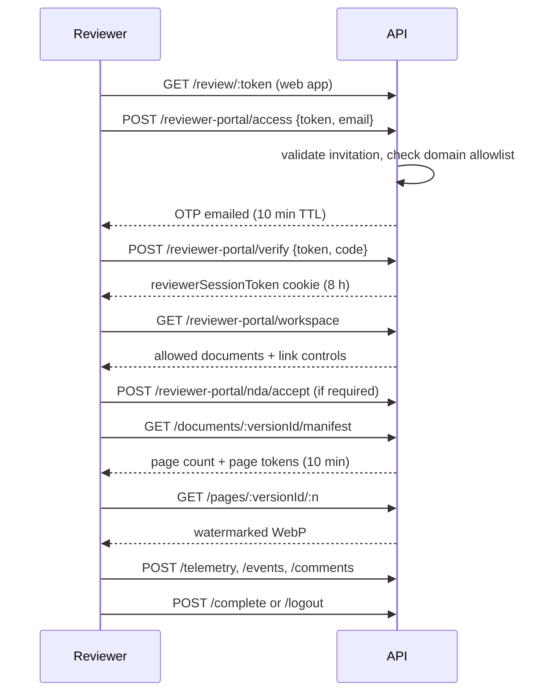

# Reviewer portal

The external data room: how a founder shares fundraising documents with an
investor without handing over a file, and what the founder learns afterwards.

This is the highest-risk surface in the product the only place unauthenticated
outsiders reach workspace content so almost every design choice here is a
containment decision.

## Design principles

1. **No source files leave the server.** Reviewers see rendered, watermarked
   page images. The manifest endpoint deliberately has no route to a signed
   object URL.
2. **Scope is an explicit allowlist.** An invitation pins specific document
   versions. Nothing else in the workspace is reachable, including newer
   versions of the same document.
3. **Every control is per link.** Expiry, download, print, watermark,
   screenshot guard, NDA, allowed domains, and notify-on-open are invitation
   fields, not global settings.
4. **Reviewers are never founders.** A separate cookie, a separate table, a
   separate middleware, and routes that live only under `/reviewer-portal`.
5. **Deterrents are labeled as deterrents.** Watermarks and screenshot guards
   raise the cost of leaking and make a leak attributable. They do not make it
   impossible, and the docs should not pretend otherwise.
6. **Telemetry is a signal, not an accusation.** "Suspected forward" means the
   pattern is consistent with forwarding it is not proof.

## Founder side

**Create an invitation** (`POST /startups/:startupId/reviewer-invitations`,
`documents:share`) with:

| Field | Default | Effect |
|---|---|---|
| Document versions | | The allowlist. Only `renderStatus: ready` versions can be shared |
| `expiresAt` | | Hard expiry, checked on every request |
| `allowedEmailDomains` | `[]` | Restricts who may verify |
| `allowDownload` | `false` | Enables the watermarked PDF download |
| `allowPrint` | `false` | Print affordance in the viewer |
| `watermarkEnabled` | `true` | Server-side watermark burn-in |
| `screenshotGuard` | `true` | Client-side screenshot deterrent + event recording |
| `notifyOnOpen` | `true` | Notify the sender when the link is opened |
| `requireNda` | `false` | Click-through confidentiality agreement |

The link token is emailed via the `email` queue and stored only as `tokenHash`.
Delivery state (`deliveryStatus`, `deliveryAttempts`, `deliveryGeneration`) is
tracked so a failure is visible rather than silent.

**Manage:** revoke (`/revoke`), resend (`/resend`), read the engagement summary
(`/analytics`) or the paginated activity feed (`/activity`), and work the
comment inbox (`/comments`, `/comments/:id/read`, `/comments/:id/resolve`).

XLSX and TXT versions have `renderStatus: "unsupported"` valid vault and AI
documents, but not shareable through the portal, because there are no page
images to serve.

## Reviewer side



| Step | Detail |
|---|---|
| Access | OTP is HMAC-hashed, 10-minute TTL, rate limited to 10 per 10 minutes per IP |
| Session | `ReviewerSession` row, 8-hour TTL, `reviewerSessionToken` cookie stored hashed |
| Per-request checks | `requireReviewerSession` re-validates session revocation, session expiry, invitation revocation, invitation status, and invitation expiry on **every** request |
| NDA | The rendered text is snapshotted onto the invitation, so accepting an old link accepts exactly the version that was sent (template `raise-reviewer-nda.v1`) |
| Pages | Two factors: the session cookie **and** a 10-minute HMAC page token whose embedded session id must match the cookie's session |
| Download | Only when `allowDownload`; watermarked PDF; 10 per hour |
| Comments | Tied to a document version, and to a chunk where applicable, so founder context is precise |

Verification failures are uniform by design: `verifyPageToken` returns null for
anything malformed, mis-signed, or expired, and callers must not report which
check failed.

## Watermarking

`watermark.service.ts` burns the reviewer's identity into the page image with
`sharp` before it leaves the server. This is the layer that survives a
screenshot, a crop, or a phone photo the live overlay in the client is
cosmetic by comparison.

Each tile prints the reviewer's email alongside a short link id
(`FPF-XXXXXX`, derived from the invitation id), so **a cropped watermark still
identifies which link leaked**. Rendered tiles are cached in Redis for an hour.

`pdf-watermark.service.ts` does the equivalent for the downloadable PDF.

## Telemetry and engagement

| Model | Holds |
|---|---|
| `ReviewerVisit` | One visit: total active ms, pages viewed, max page reached, completion %, device/IP hashes, `suspectedForward` |
| `ReviewerPageView` | Per-page active time and view count |
| `ReviewerEvent` | Copy, print, screenshot, and `forward_suspected` security events |

The client flushes active time every 10 seconds. The server caps a single flush
at 12 seconds of active time the flush interval plus jitter slack, well below
the schema's 120-second sanity bound so a hostile client cannot inflate
engagement with one large report.

### Forward suspicion

Device and IP are stored **hashed** (`hashForwardSignal`), never raw. When one
invitation shows two or more distinct device hashes or IP hashes, the visit is
flagged `suspectedForward`, a `forward_suspected` event is written, and the
sender is notified.

That is a signal, not proof: an investor legitimately opening a link on a laptop
and a phone produces the same pattern. Repeat alerts for the same invitation are
suppressed for a cooldown window.

## Privacy retention

Reviewer access creates short-lived credentials and privacy-sensitive network
and device signals. A daily scheduled task at **03:45**
(`reviewer-data-retention`, dispatching into `reviewer-retention.ts`'s
`enforceReviewerRetention()`) prunes them in one transaction. See
[background-jobs.md](background-jobs.md#scheduled-tasks).

| Data | Default window | Action | Variable |
|---|---:|---|---|
| Expired, unverified access challenges | 24 hours | Delete the session row | `REVIEWER_CHALLENGE_RETENTION_HOURS` |
| Credentials on expired/revoked sessions | immediate | Null out session token, verification code, expiry | |
| Session IP and user agent | 30 days | Redact | `REVIEWER_NETWORK_RETENTION_DAYS` |
| Visit device/IP hashes and referrer | 30 days | Redact | `REVIEWER_NETWORK_RETENTION_DAYS` |
| Detailed page-view rows | 365 days | Delete | `REVIEWER_ENGAGEMENT_RETENTION_DAYS` |
| Copy/print/screenshot events | 365 days | Delete | `REVIEWER_EVENT_RETENTION_DAYS` |

**Never deleted by retention:** invitations, reviewer comments, and aggregate
visit results. Founder-facing evidence outlives the raw signals that produced
it.

Every window must be a positive integer; the API validates them at boot.

## Metrics and alerting

`GET /metrics` exposes bounded Prometheus-compatible reviewer metrics. It is
disabled by default and requires a dedicated 32+ character bearer token:

```dotenv
METRICS_ENABLED=true
METRICS_TOKEN=<32+ random characters>
```

Keep it on a private network even with authentication. **Labels are
deliberately bounded** and never include emails, IP addresses, invitation ids,
session ids, document ids, or startup ids an unbounded label is both a
cardinality explosion and a privacy leak.

| Metric | Type | Labels |
|---|---|---|
| `raise_reviewer_portal_http_requests_total` | counter | `operation`, `status_class` |
| `raise_reviewer_portal_http_request_duration_seconds` | summary | `operation` |
| `raise_reviewer_rate_limit_hits_total` | counter | `scope` |
| `raise_reviewer_retention_runs_total` | counter | `outcome` |
| `raise_reviewer_retention_records_total` | counter | `action` |
| `raise_reviewer_retention_last_success_timestamp_seconds` | gauge | |

Recommended starting alerts:

- No successful retention run for 48 hours.
- Reviewer access or verification 5xx above 1% for 10 minutes.
- Reviewer download or page 5xx above 1% for 10 minutes.
- A sustained rise in access or download rate-limit hits.
- Email worker log events with `event=reviewer_email_failed`.

## Code map

| Concern | File |
|---|---|
| Founder-side invitations | `services/reviewer-invitation.service.ts` |
| Reviewer flows | `services/reviewer-portal.service.ts` |
| Comments | `services/reviewer-comment.service.ts` |
| Activity and analytics | `services/reviewer-activity.service.ts` |
| Session middleware | `middleware/reviewer-auth.ts` |
| Page tokens | `utils/page-token.ts` |
| Image watermark | `services/watermark.service.ts` |
| PDF watermark | `services/pdf-watermark.service.ts` |
| NDA template | `config/reviewer-nda.ts` |
| Retention job | `jobs/reviewer-retention.ts` |
| Metrics | `observability/reviewer-metrics.ts` |
| Reviewer UI | `packages/web/src/pages/review/` |
| Founder UI | `packages/web/src/pages/dashboard/Reviewers.tsx` and the reviewer sheets |
